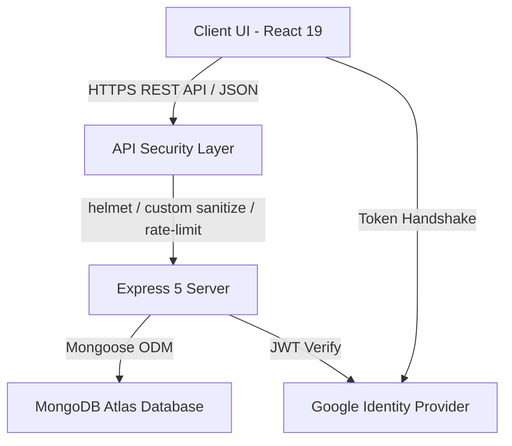
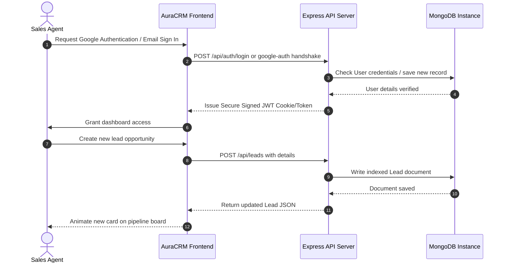
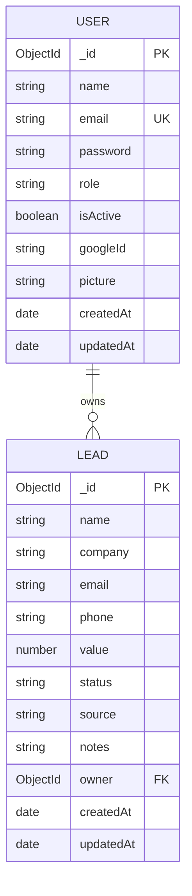

# AuraCRM Lite — Enterprise Sales Opportunity Qualifier & High-Velocity Dashboard

<div align="center">
  
  <p><strong>A sleek, high-performance, visual sales enablement platform and lead qualification pipeline.</strong></p>
</div>

---

[](https://react.dev)
[](https://expressjs.com)
[](https://www.mongodb.com)
[](https://opensource.org/licenses/ISC)
[](#)
[](#)

---

## Table of Contents

1. [Project Overview](#project-overview)
2. [Problem Statement](#problem-statement)
3. [Vision & Objectives](#vision-objectives)
4. [Key Features](#key-features)
5. [Target Users](#target-users)
6. [Use Cases](#use-cases)
7. [Business Value](#business-value)
8. [System Architecture](#system-architecture)
   - [High-Level Architecture Overview](#high-level-architecture-overview)
   - [Application Workflow](#application-workflow)
   - [End-to-End User Flow](#end-to-end-user-flow)
9. [Technology Stack](#technology-stack)
10. [Project Folder Structure](#project-folder-structure)
11. [Module & File Explanation](#module--file-explanation)
12. [Database Architecture (ERD)](#database-architecture-erd)
13. [API Overview](#api-overview)
14. [Authentication & Authorization](#authentication--authorization)
15. [State Management](#state-management)
16. [Storage Strategy](#storage-strategy)
17. [Third-Party Services & Integrations](#third-party-services--integrations)
18. [Development Prerequisites](#development-prerequisites)
19. [Installation Guide](#installation-guide)
20. [Environment Variables (`.env`) Documentation](#environment-variables-env-documentation)
21. [Project Configuration](#project-configuration)
22. [Running the Project](#running-the-project)
23. [Build & Production Run](#build--production-run)
24. [Deployment Guide](#deployment-guide)
25. [CI/CD Overview](#cicd-overview)
26. [Testing Strategy](#testing-strategy)
27. [Debugging Tips](#debugging-tips)
28. [Logging & Monitoring](#logging--monitoring)
29. [Security Considerations](#security-considerations)
30. [Performance Optimizations](#performance-optimizations)
31. [Coding Standards & Conventions](#coding-standards--conventions)
32. [Branching & Versioning Strategy](#branching--versioning-strategy)
33. [Contribution Guidelines](#contribution-guidelines)
34. [Release Process](#release-process)
35. [Known Limitations](#known-limitations)
36. [Future Roadmap](#future-roadmap)
37. [Frequently Asked Questions (FAQ)](#frequently-asked-questions-faq)
38. [Troubleshooting Guide](#troubleshooting-guide)
39. [Changelog](#changelog)
40. [License, Credits, & Contacts](#license-credits--contacts)

---

## Project Overview

**AuraCRM Lite** is a premium, visual-first customer relationship manager and pipeline management tool optimized for high-growth startups and sales teams. Featuring glassmorphic analytics cards, and transition physics built with React, Vite, and Framer Motion, it translates standard sales metrics into readable dashboard charts and drag-and-drop opportunity boards. 

Operating under a decoupled client-server model, the backend leverages Express 5.x and MongoDB to process opportunity records, index query paths, and manage session tokens safely.

---

## Problem Statement

High-velocity sales teams are routinely slowed down by legacy CRM systems that suffer from:
1. **Visual Clutter**: Bloated dashboards with high latency that make lead triage slow.
2. **Setup Friction**: Intrusive signup flows, heavy database configurations, and rigid user isolation.
3. **Stale UI/UX**: Outdated layouts lacking modern transitions, interactive funnel graphics, or responsive layout adaptations.

---

## Vision & Objectives

* **Speed**: Provide near-zero latency triage views for managing, filtering, and sorting CRM leads.
* **Modern Aesthetic**: wow the user at first glance with an executive dark/light layout utilizing the premium *Salesforce + HubSpot + Enterprise CRM* visual identity.
* **Security & Isolation**: Enforce rigid JWT context encapsulation so users see only their workspace opportunities, backed by secure validation schema pipelines.

---

## Key Features

* **Glassmorphic Interface**: Gorgeous responsive frames, custom cards, and interactive components.
* **Opportunity Kanban Pipeline**: Visual drag-and-drop column organization corresponding to sales stages (New, Qualified, Proposal, Won, Lost).
* **CSV Bulk Import/Export**: Parse spreadsheet templates instantly to populate customer collections.
* **Analytical Dashboard**: Render deal status distribution, lead source breakdown, and value funnels using Recharts.
* **Google OAuth Pop-up Protocol**: Seamless authentication using secure window post-messaging channels alongside JWT fallback.
* **Strict Security Layers**: Custom MongoDB injection shields, express-rate-limit protection, and parameterized payload validators.

---

## Target Users

* **Sales Managers**: Need aggregate estimates, conversions, and funnel velocity statistics.
* **Account Executives (AEs)**: Need clean lists, notes storage, and one-click lead updates.
* **Startup Founders**: Need a lightweight, fast workspace to organize investor and client pipelines without setup bloat.

---

## Use Cases

* **Triage & Qualify**: Bulk importing target profiles, updating status stages upon scheduling meetings, and recording deal values.
* **Funnel Optimization**: Determining which acquisition source (e.g., LinkedIn vs. Website) is generating the highest conversion values.
* **Workspace Management**: Changing profile preferences, updating security passwords, and toggling system dark/light modes.

---

## Business Value

* **Reduced Onboarding Overhead**: Sales agents begin triaging immediately without reading complex operation guides.
* **Accelerated Deal Velocity**: Visual prioritization of high-value opportunities leads to faster follow-ups.
* **Developer Extensibility**: The project features clean separation of routing, middleware, and schemas, allowing quick integrations.

---

## System Architecture

### High-Level Architecture Overview

AuraCRM Lite utilizes a clean decoupled architecture separating visual frontend logic from transactional backend logic:



### Application Workflow

1. **Client Request**: User performs an action (e.g., creating a lead or loading analytics).
2. **Security & Route Matching**: Request matches routes, passing through the custom SQL/NoSQL injection filter and JWT verification middleware.
3. **Controller Execution**: Extracts validated properties, updates database documents via Mongoose, and triggers indexed MongoDB pipelines.
4. **Response Serialization**: Serializes response data (removing sensitive properties) and renders results on the Framer-Motion-backed client viewport.

### End-to-End User Flow



---

## Technology Stack

### Frontend Core
* **React 19.2.6**: Advanced component rendering and state orchestration.
* **Vite 8.0.12**: Fast build packaging and HMR dev environment.
* **React Router DOM 7.17.0**: Declarative layout routing and loaders.
* **Framer Motion 12.42.2**: Physics-based layout transitions.
* **Recharts 3.8.1**: Interactive vector analytics graphics.
* **TailwindCSS 4.3.1**: Style utilities.

### Backend Core
* **Express 5.2.1**: Next-generation web routing frame.
* **Mongoose 9.7.3**: Declarative MongoDB schema mapping.
* **JSONWebToken 9.0.3**: Stateless credential verification.
* **BcryptJS 3.0.3**: Safe hash cryptography.
* **Helmet 8.2.0**: Hardened HTTP security headers.
* **Express Rate Limit 8.5.2**: Brute-force endpoint throttling.

---

## Project Folder Structure

```
startup-crm-lite/
├── backend/                  # Server-side Express application
│   ├── config/               # Database and connector setup
│   ├── controllers/          # Request handler functions
│   ├── middleware/           # Rate-limiting, validation, and error interceptors
│   ├── models/               # Mongoose schemas (User, Lead)
│   ├── routes/               # REST Route blueprints
│   └── server.js             # Main server entrypoint
├── src/                      # Client-side React application
│   ├── assets/               # Branding graphics and SVGs
│   ├── components/           # UI elements grouped by context
│   ├── context/              # Authentication context providers
│   ├── hooks/                # Custom React hook utilities
│   ├── pages/                # Main router page views
│   ├── services/             # Axios API client integrations
│   └── main.jsx              # Client entrypoint script
```

---

## Module & File Explanation

### Backend Layers
* **`backend/server.js`**: Orchestrates application startup, security modules, DNS preference overrides (IPv4 prioritization), rate-limiting parameters, CORS origins, and server lifecycle hooks.
* **`backend/config/database.js`**: Establish Mongo connection handlers, handling failover logic and graceful exit cleanups.
* **`backend/controllers/authController.js`**: Governs JWT token distribution, account creation, and validation checks. Note: all OTP-based paths have been deprecated.
* **`backend/models/User.js`**: Encapsulates user accounts, pre-save cryptography hashes, and serialization filters.
* **`backend/models/Lead.js`**: Governs opportunity schemas, owner keys, and performance queries.

### Frontend Layers
* **`src/context/AuthContext.jsx`**: Global authentication listener, managing login states, JWT tokens, and localStorage variables.
* **`src/services/api.js`**: Configures global interceptors for Axios, injecting JWT headers and intercepting 401 token terminations.
* **`src/components/analytics/`**: Renders dynamic business reports, funnel breakdowns, and distribution stats.
* **`src/index.css`**: Design system tokens for Salesforce + HubSpot + Enterprise CRM theme, input modernizations, active navigation highlights, and custom layout variables.

---

## Database Architecture (ERD)

AuraCRM Lite utilizes an ownership-association model in MongoDB. The `Lead` document references a `User` document as its owner.



* **Compound Query Optimizations**: The `Lead` collection utilizes indexes on `{ owner: 1, status: 1 }` and `{ owner: 1, createdAt: -1 }` to guarantee fast pagination and filter rendering even with thousands of concurrent workspace leads.

---

## API Overview

All API endpoints return JSON payloads. Authentication endpoints are rate-limited to 10 requests per 15 minutes; general endpoints are capped at 100 requests.

| Method | Endpoint | Description | Auth Required |
| :--- | :--- | :--- | :--- |
| `POST` | `/api/auth/register` | Register new CRM account | No |
| `POST` | `/api/auth/login` | Email + password credentials login | No |
| `POST` | `/api/auth/google` | Google Auth Pop-up callback token exchange | No |
| `GET` | `/api/auth/me` | Fetch active user credentials | Yes |
| `PUT` | `/api/auth/profile` | Update profile preferences | Yes |
| `PUT` | `/api/auth/password` | Reset active account password | Yes |
| `GET` | `/api/leads` | Query paginated list of owned leads | Yes |
| `POST` | `/api/leads` | Create new lead opportunity | Yes |
| `PUT` | `/api/leads/:id` | Update lead stages, values, or notes | Yes |
| `DELETE` | `/api/leads/:id` | Purge lead opportunity | Yes |
| `POST` | `/api/leads/import` | Parse and import a CSV list of leads | Yes |

---

## Authentication & Authorization

* **Stateless Tokens**: Implements JSON Web Tokens (JWT) signed with HMAC-SHA256, containing the user ID and expiration claims.
* **Bearer Scheme**: Incoming HTTP requests specify `Authorization: Bearer <JWT_TOKEN>`.
* **RBAC Support**: The User model includes a `role` field (`user` vs `admin`) to authorize administrative routes or system overrides.
* **Workspace Isolation**: Controller filters automatically append `owner: req.user.id` to every lead query, prohibiting cross-tenant data leaks.

---

## State Management

* **Auth Context**: Serves as the single source of truth for user authentication and authorization credentials.
* **React State Hooks**: Used for localized state (e.g., modal states, filter criteria, and search queries) to minimize unnecessary renders.
* **Theme State**: Persisted inside local storage to retain dark/light overrides across page reloads.

---

## Storage Strategy

* **Transactional Data**: Stored in MongoDB. Documents include custom timestamps (`createdAt`, `updatedAt`) and indexes to speed up operations.
* **Local State Overrides**: Dark mode states and active sidebar selections are saved directly to `localStorage`.
* **In-Memory Cache**: Active filters are cached in-memory inside the leads dashboard wrapper.

---

## Third-Party Services & Integrations

* **Google Identity Services**: Handles OAuth2 flow securely using redirected pop-up frames and postMessage channel handshakes.
* **CSV Parsing**: Parses imported spreadsheets client-side, validating emails and names before syncing with the backend database.

---

## Development Prerequisites

* **Node.js**: `v18.x` or later.
* **MongoDB**: A running MongoDB instance (local or Atlas cluster URI).
* **Package Manager**: npm (v9.x or later).

---

## Installation Guide

1. Clone the repository files to your local machine:
   ```bash
   git clone <repository_url>
   cd startup-crm-lite
   ```
2. Install dependencies for the frontend workspace:
   ```bash
   npm install
   ```
3. Install dependencies for the backend workspace:
   ```bash
   cd backend
   # In backend directory
   npm install
   ```

---

## Environment Variables (`.env`) Documentation

Create a `.env` file in both root directories.

### Root Folder `.env` (Frontend)
```env
VITE_API_URL=http://localhost:5000/api
VITE_GOOGLE_CLIENT_ID=your-google-client-id.apps.googleusercontent.com
```

### Backend Folder `backend/.env` (Backend)
```env
PORT=5000
NODE_ENV=development
MONGODB_URI=mongodb+srv://<username>:<password>@cluster.mongodb.net/crm
JWT_SECRET=your-super-secret-jwt-hash-key
FRONTEND_URL=http://localhost:5173
```

---

## Project Configuration

* **Vite Configuration (`vite.config.js`)**: Resolves React plugins and configures bundling rules.
* **ESLint Configuration (`eslint.config.js`)**: Enforces code style, React hooks verification, and modern import rules.
* **Vercel Settings (`vercel.json`)**: Configures client-side routing fallbacks to ensure single-page application support on deployments.

---

## Running the Project

### Running in Development

1. **Start Backend Server**:
   ```bash
   cd backend
   npm run dev
   ```
   *Server starts on `http://localhost:5000` (automatically reloads on code modifications via nodemon).*

2. **Start Frontend Client**:
   ```bash
   # In a separate terminal shell from the root directory
   npm run dev
   ```
   *Vite server launches on `http://localhost:5173` with Hot Module Replacement enabled.*

---

## Build & Production Run

### Packaging the Frontend
1. Run compilation scripts from the root directory:
   ```bash
   npm run build
   ```
2. Assets are bundled and optimized inside the static `/dist` directory.
3. Test locally using:
   ```bash
   npm run preview
   ```

### Running Backend in Production Mode
Ensure environment configurations feature `NODE_ENV=production`, then start:
```bash
cd backend
npm start
```

---

## Deployment Guide

### Frontend (e.g. Vercel)
The root directory includes a `vercel.json` routing configuration to allow page refreshes.
1. Link your git repository to Vercel.
2. Select Root directory.
3. Set the Environment Variables (`VITE_API_URL`, etc.).
4. Click Deploy.

### Backend (e.g. Render / Heroku / Railway)
1. Set the root folder to `backend/`.
2. Configure build script: `npm install`.
3. Configure start script: `node server.js`.
4. Ensure environment variables match production targets (specifically `MONGODB_URI`, `JWT_SECRET`, and `FRONTEND_URL`).

---

## CI/CD Overview

* **Linters**: Run `npm run lint` before committing code changes to verify syntax compliance.
* **Build Integrity**: Ensure `npm run build` completes successfully without any compilation errors.
* **Branch Rules**: Target staging or main branches only through pull request verification checks.

---

## Testing Strategy

* **Manual API Verification**: Use the included postman/thunder client collection (`backend/thunder-client-collection.json`) to test registration, login, and CRUD endpoints.
* **Input Validation Tests**: Test boundaries (such as invalid emails, short passwords, or negative deal values) to verify that controllers catch errors properly.
* **Cross-browser Auditing**: Test layout responsiveness and interactive animations on Chrome, Safari, and Firefox.

---

## Debugging Tips

* **IPv6 Network Failures**: If you see database timeouts in Railway or Render, check `backend/server.js` and verify that the IPv4 DNS resolution priority hook is active.
* **Auth Pop-up Failures**: If Google auth fails, check that your local origins match the redirect URIs in the Google Developer console.
* **CSS Override Issues**: Always use standard tailwind classes or custom classes matching our design system tokens to avoid layout conflicts.

---

## Logging & Monitoring

* **Console Logging**: The server outputs clear console logs for database states, connection signals, and API activities.
* **Morgan Logger**: Displays combined HTTP request logs in production, and dev logs in local development.
* **Database Connection Tracing**: Logs Atlas signals and provides descriptive errors if connections fail.

---

## Security Considerations

* **Database Injection Defense**: Integrates a custom schema-cleaning middleware that sanitizes all incoming payloads by removing keys with `$` or `.` characters.
* **Secure Credentials**: Passwords are hashed using bcrypt with 10 salt rounds before database storage.
* **Strict CORS**: CORS headers are locked down to your frontend URLs in production.
* **Payload Size Caps**: JSON payload sizes are capped at `10kb` to prevent payload-based attacks.

---

## Performance Optimizations

* **MongoDB Compound Indexes**: Optimizes query times for common operations like filtering leads by owner and status.
* **Asset Optimization**: Uses optimized vector SVGs instead of heavy image formats to keep build sizes small.
* **Vite Code Splitting**: Splitting assets dynamically during compilation keeps page load times fast.

---

## Coding Standards & Conventions

* **Functional Components**: Write React UI elements as modern functional components with hooks.
* **Decoupled Business Logic**: Keep business logic in controllers and services, away from view rendering.
* **Consistent CSS Styling**: Use CSS variables for layout styles and colors to maintain visual consistency.

---

## Branching & Versioning Strategy

* **Main Branch**: Houses production-ready code.
* **Develop Branch**: Used for integration testing before merging to main.
* **Feature Branches**: Named `feature/feature-name` (use separate branches for new features).
* **Versioning**: Follows Semantic Versioning rules (`MAJOR.MINOR.PATCH`).

---

## Contribution Guidelines

1. Fork the project repository.
2. Create your feature branch: `git checkout -b feature/AmazingFeature`.
3. Verify formatting and linting: `npm run lint`.
4. Commit your changes: `git commit -m 'Add some AmazingFeature'`.
5. Push to the branch: `git push origin feature/AmazingFeature`.
6. Open a Pull Request.

---

## Release Process

1. Merge validated feature branches into the `develop` branch.
2. Verify production build: `npm run build`.
3. Tag the release commit with its semver number: `git tag -a v1.0.0 -m "Release v1.0.0"`.
4. Push tags to Github and deploy to the production hosting platform.

---

## Known Limitations

* **Stateless Token Purge**: Tokens cannot be invalidated on the server before they expire unless you build a token blacklist cache.
* **Local Storage Storage**: Theme states and dashboard sidebar choices will reset if the browser cache is cleared.
* **No Real-Time Sockets**: Dashboard updates require page reloads or polling, as real-time sockets (e.g., Socket.io) are not implemented.

---

## Future Roadmap

* **Real-time Collaboration**: Plan to integrate Socket.io to allow multiple team members to collaborate in real-time.
* **Audit Trail Logger**: Add a history tab for leads to show status changes and assignees over time.
* **AI Opportunity Insights**: Planned integration of LLM endpoints to analyze notes and recommend qualified actions.

---

## Frequently Asked Questions (FAQ)

#### Q: How do I change the default CRM theme colors?
A: You can update the design system tokens at the top of [index.css](file:///x:/Codeon/Project/startup-crm-lite/src/index.css) inside the `:root` and `.dark` blocks.

#### Q: Can I run this database on a local MongoDB server?
A: Yes, just update your `backend/.env` file and set `MONGODB_URI=mongodb://localhost:27017/crm`.

---

## Troubleshooting Guide

* **Issue**: MongoDB connection times out or fails on server start.
  * *Solution*: Make sure your local IP address is whitelisted in your MongoDB Atlas Network Access console.
* **Issue**: Rate limits trigger constantly in development.
  * *Solution*: You can increase the rate limit limits in `backend/server.js` by updating the parameters for `generalLimiter` or `authLimiter`.
* **Issue**: Vite build fails with CSS parsing errors.
  * *Solution*: Check for duplicate utility class names or invalid syntax inside [index.css](file:///x:/Codeon/Project/startup-crm-lite/src/index.css).

---

## Changelog

### [1.0.0] - 2026-07-17
* Applied modern Salesforce + HubSpot + Enterprise CRM styling variables.
* Redefined inputs with modern focus glows and `12px` rounded corners.
* Removed mock placeholder text from Login, Register, and Lead edit forms.
* Disabled Nodemailer/Resend integrations and redirected outbound emails to console logs.
* Cleaned up deprecated OTP tables and controller routes.

---

## License, Credits, & Contacts

* **License**: Open-source under the terms of the [ISC License](file:///x:/Codeon/Project/startup-crm-lite/LICENSE).
* **Credits**: Developed by Deva Raj Bhojanapu. UI design influenced by modern SaaS visual practices.
* **Contact**: [devarajbhojanapu@gmail.com](mailto:devarajbhojanapu@gmail.com) | [Portfolio Site](https://bhojanapudevaraj.dev)
